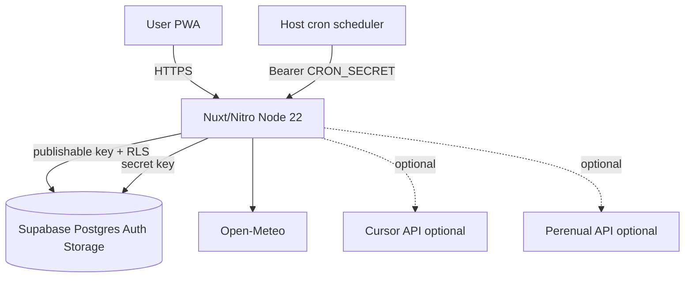

# Self-hosting Monstera

Guide for running your own Monstera instance with a Supabase project and a Node.js host.

## Requirements

- **Node.js 22** (matches CI)
- A [Supabase](https://supabase.com) project (hosted is recommended)
- HTTPS domain for production (required for PWA and magic-link auth)
- Optional: system cron or another scheduler for background jobs

## Architecture



## 1. Supabase setup

1. Create a project at [supabase.com](https://supabase.com).
2. Link the CLI and apply migrations from this repository:

```bash
npx supabase link
npx supabase db push
```

Migrations create all tables, RLS policies, and the private `plant-photos` storage bucket. No manual dashboard steps are needed for schema or storage.

### Auth (production)

In **Authentication → URL configuration**:

| Setting | Example |
|---------|---------|
| **Site URL** | `https://your-domain.example` |
| **Redirect URLs** | `https://your-domain.example/confirm`, `http://localhost:3000/**` |

Magic links use the template in [`supabase/templates/magic_link.html`](../supabase/templates/magic_link.html).

For production email delivery, configure **SMTP** under **Project Settings → Authentication**. For local development, `supabase start` provides [Inbucket](http://localhost:54324) to capture emails.

### Demo plant data

Several migrations seed example plants and sites (e.g. Despacho, Oreja Polly) for the **first registered user** only. They run automatically on `db push`. This is intentional demo content, not live user data.

## 2. Environment variables

Copy [`.env.example`](../.env.example) to `.env` and fill in values from **Project Settings → API**.

### Required (core app)

| Variable | Supabase key | Purpose |
|----------|--------------|---------|
| `SUPABASE_URL` | Project URL | API endpoint |
| `SUPABASE_KEY` | **Publishable** (anon) | Client; respects RLS |
| `NUXT_SUPABASE_SECRET_KEY` | **Secret** (service_role) | Server routes only |

> Never expose the **Secret** key in the frontend or commit it to Git.  
> Aliases `NUXT_PUBLIC_SUPABASE_URL` / `NUXT_PUBLIC_SUPABASE_KEY` / `SUPABASE_SECRET_KEY` are also supported.

### Optional — AI and species

| Variable | If missing |
|----------|--------------|
| `CURSOR_API_KEY` | `/api/diagnose` and `/api/recommend` return 503 |
| `PERENUAL_API_KEY` | Species tab returns 503 (Cursor is fallback only when Perenual fails) |

Plant care, calendar, photos, and sites work with Supabase alone.

### Optional — weather defaults

| Variable | Default | Purpose |
|----------|---------|---------|
| `NUXT_PUBLIC_HOME_LAT` | `40.4168` | Default latitude for weather |
| `NUXT_PUBLIC_HOME_LON` | `-3.7038` | Default longitude for weather |

[Open-Meteo](https://open-meteo.com/) is used for weather and exterior watering recalculation. No API key is required.

### Optional — Web Push

```bash
npx web-push generate-vapid-keys
```

| Variable | Purpose |
|----------|---------|
| `NUXT_PUBLIC_VAPID_PUBLIC_KEY` | Browser subscription |
| `VAPID_PRIVATE_KEY` | Server signing |
| `CRON_SECRET` | Authorize cron endpoints (see below) |

## 3. Build and run

```bash
npm ci
npm run build
node .output/server/index.mjs
```

For a quick local production check:

```bash
npm run preview
```

Deploy the Nitro output (`.output/`) on any Node 22 host (VPS, Railway, Fly.io, etc.) with the same environment variables.

## 4. Scheduled jobs (non-Vercel)

[`vercel.json`](../vercel.json) defines two cron jobs. Replicate them on your host with `curl` and `CRON_SECRET`.

**Important:** On self-hosted deployments, the `x-vercel-cron` header is not sent. Set `CRON_SECRET` in production; without it, cron endpoints return **403**.

| Endpoint | Schedule (UTC) | Purpose |
|----------|----------------|---------|
| `GET /api/cron/send-daily` | `0 9 * * *` (daily 09:00) | Push reminders for pending care tasks |
| `GET /api/cron/recalculate-watering` | `0 0 */2 * *` (every 2 days, midnight) | Adjust exterior watering from Open-Meteo |

Example crontab (`CRON_SECRET` and domain as env vars or literals):

```bash
# Daily push (09:00 UTC)
0 9 * * * curl -fsS -H "Authorization: Bearer $CRON_SECRET" \
  https://your-domain.example/api/cron/send-daily

# Exterior watering recalc (every 2 days, midnight UTC)
0 0 */2 * * curl -fsS -H "Authorization: Bearer $CRON_SECRET" \
  https://your-domain.example/api/cron/recalculate-watering
```

Manual push test:

```bash
curl -X POST -H "Authorization: Bearer $CRON_SECRET" \
  https://your-domain.example/api/push/send-daily
```

Cron auth also accepts `x-cron-secret: <CRON_SECRET>`.

## 5. Local development

```bash
cp .env.example .env
# Fill .env with local Supabase keys from `supabase start` or a dev project

npm install
npm run dev
```

Optional local Supabase stack:

```bash
npx supabase start
npx supabase db push   # if not already applied
```

`supabase db reset` runs migrations plus [`supabase/seed.sql`](../supabase/seed.sql) (empty by default).

## 6. Before making the repository public

If you maintain a production instance, rotate secrets as a precaution when opening the repo:

- Supabase publishable and secret keys
- `CURSOR_API_KEY`, `PERENUAL_API_KEY`
- VAPID keys and `CRON_SECRET`

Confirm `.env` is not tracked (`git check-ignore .env` should succeed). Ensure `CRON_SECRET` is set on your production host.

## See also

- [README](../README.md) — quick start
- [CONTRIBUTING.md](../CONTRIBUTING.md) — development workflow
- [SECURITY.md](../SECURITY.md) — reporting vulnerabilities
- [architecture.md](./architecture.md) — system overview for operators
